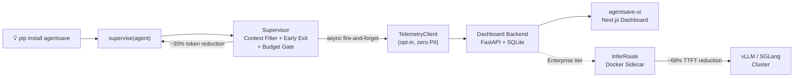

# AgentSave — Save 30% on AI agent costs. One line of code.

[](https://github.com/aks-builds/agentsave/actions)
[](LICENSE)
[](https://github.com/aks-builds/agentsave/actions)

> The first AI agent efficiency platform. Drop-in Python supervisor + real-time cost dashboard + inference router. Zero accuracy loss.




## 🔥 The Problem

- Every LLM agent wastes 30–50% of tokens on irrelevant tool outputs — inflating costs with no accuracy gain
- Agents over-iterate past diminishing returns, burning tokens on iterations that add nothing
- Developers have zero visibility into which agents, models, and frameworks are costing them the most

## ⚡ The Solution

### SDK Layer

`pip install agentsave`, then wrap any agent with `supervise(agent)`. The supervisor filters irrelevant context, exits early on diminishing returns, and enforces a budget gate — delivering ~30% token reduction with zero changes to your agent's internals.

### Dashboard Layer

Real-time cost tracking across every run, with a per-framework breakdown, an hourly activity heatmap, and an interactive cost projector to forecast monthly savings.

### InferRoute Layer

PPD (append-prefill decode) routing for multi-turn agent workloads, delivering ~68% Turn 2+ TTFT reduction. Available on the Enterprise tier as a Docker sidecar in front of your vLLM / SGLang cluster.

## 🎬 In Action

1. Overview dashboard — real-time savings stats with animated counters
   
2. Analytics — token reduction trend over time (area/line/bar toggle)
   
3. Agent Runs — full run history with framework badges and reduction %
   
4. Cost Projector — interactive sliders to project monthly savings
   
5. Live Activity Feed — real-time agent run stream
   
6. Hourly Heatmap — GitHub-style activity grid
   
7. Command Palette — instant navigation and actions (⌘K)
   
8. Billing — Free / Pro / Enterprise tiers
   

## 🚀 Quick Start

1. Install the SDK: `pip install agentsave`
2. Wrap your agent:
   ```python
   from agentsave import supervise
   agent = supervise(your_agent)
   ```
3. Run your agent normally — token savings happen automatically
4. Connect dashboard: `agentsave login`
5. View savings: `agentsave status`
6. (Optional) Start dashboard backend: `cd agentsave-dashboard && uvicorn agentsave_dashboard.main:app`
7. (Enterprise) Deploy InferRoute: `docker run -p 8080:8080 agentsave/inferroute:latest`

## 📦 Installation

**SDK (all agent frameworks):**
```bash
pip install agentsave

# With specific framework support:
pip install "agentsave[langchain]"     # LangChain + LangGraph
pip install "agentsave[autogen]"       # AutoGen
pip install "agentsave[crewai]"        # CrewAI
pip install "agentsave[smolagents]"    # Smolagents
pip install "agentsave[all]"           # All frameworks
```

**Dashboard Backend:**
```bash
git clone https://github.com/aks-builds/agentsave-dashboard
cd agentsave-dashboard
pip install -e ".[dev]"
uvicorn agentsave_dashboard.main:app --port 8000
```

**Dashboard UI:**
```bash
git clone https://github.com/aks-builds/agentsave-ui
cd agentsave-ui
npm install
npm run dev   # http://localhost:3000
```

**InferRoute (Enterprise, requires Docker):**
```bash
docker run -d -p 8080:8080 \
  -e BACKEND_URL=http://your-vllm:8000 \
  -e BACKEND_TYPE=vllm \
  -e AGENTSAVE_TOKEN=$ENTERPRISE_TOKEN \
  agentsave/inferroute:latest
```

## 🏗 Architecture

- **Drop-in, zero-modification**: `supervise(agent)` wraps any agent framework without touching internals
- **LLM-free context filter**: TF-IDF cosine similarity — no extra API calls, <1ms overhead per observation
- **ICLR 2026 research-backed**: 29.68% token reduction on GAIA benchmark (arXiv:2510.26585)
- **Five framework adapters**: LangChain, LangGraph, AutoGen, CrewAI, Smolagents — all tested
- **InferRoute PPD routing**: ~68% Turn 2+ TTFT reduction via append-prefill decode routing (ICML 2026, arXiv:2603.13358)
- **Opt-in telemetry**: zero PII — only run_id, framework, model, token counts, success flag
- **Self-hostable**: dashboard backend is MIT-licensed FastAPI + SQLite; InferRoute is a Dockerfile drop-in

## 🗺 Roadmap

**v0.2:**
- JavaScript/TypeScript SDK for Node.js agent frameworks
- Real-time WebSocket events for the live feed
- Team workspaces with RBAC

**v0.3:**
- OpenAI Responses API adapter
- Anthropic tool_use adapter
- Cost anomaly alerts (email + webhook when a run exceeds threshold)

Tracked as [GitHub Issues](https://github.com/aks-builds/agentsave/issues).

## 📁 Project Structure

```
agentsave/              ← SDK (this repo)
├── agentsave/          ← Python package
│   ├── core/           ← context filter, early exit, budget gate, supervisor
│   ├── adapters/       ← LangChain, LangGraph, AutoGen, CrewAI, Smolagents
│   ├── telemetry/      ← opt-in async telemetry client
│   └── cli/            ← agentsave login/status/config
└── tests/              ← 60 unit tests

agentsave-dashboard/    ← FastAPI + SQLite backend
├── agentsave_dashboard/
│   ├── routers/        ← /api/events, /api/metrics, /api/tokens, /api/billing
│   └── services/       ← metrics aggregation, Stripe billing
└── tests/              ← 47 tests

agentsave-ui/           ← Next.js 16 dashboard
├── app/
│   ├── components/     ← StatCard, charts, RunsTable, ActivityFeed, CommandPalette
│   └── (routes)/       ← /, /analytics, /runs, /frameworks, /cost, /settings
└── tests/e2e/          ← 30 Playwright tests

agentsave-inferroute/   ← Enterprise inference router
├── inferroute/
│   ├── classifier.py   ← Turn 1 vs Turn 2+ detection
│   ├── router.py       ← PPD scoring function
│   └── adapters/       ← vLLM + SGLang
└── tests/              ← 59 tests
```

## 🤝 Contributing

See [CONTRIBUTING.md](CONTRIBUTING.md) for setup instructions, code style, and the PR checklist.

## 📄 License

[MIT](LICENSE) © 2026 Aditya Kumar Singh
