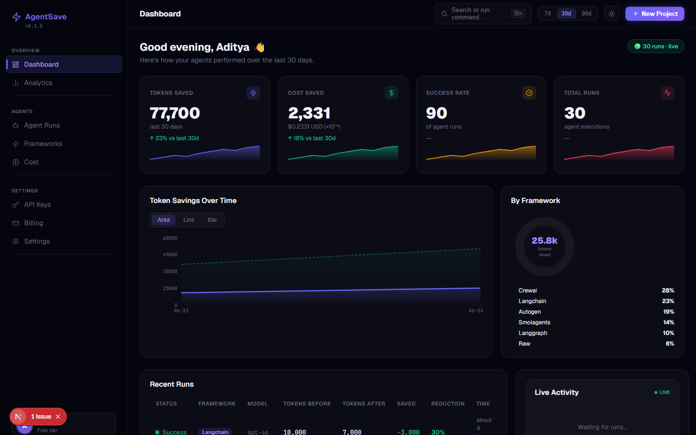
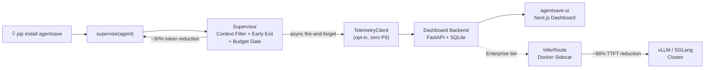
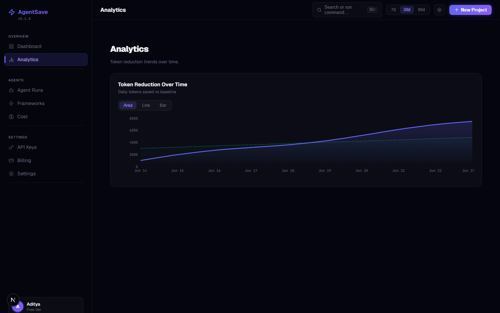
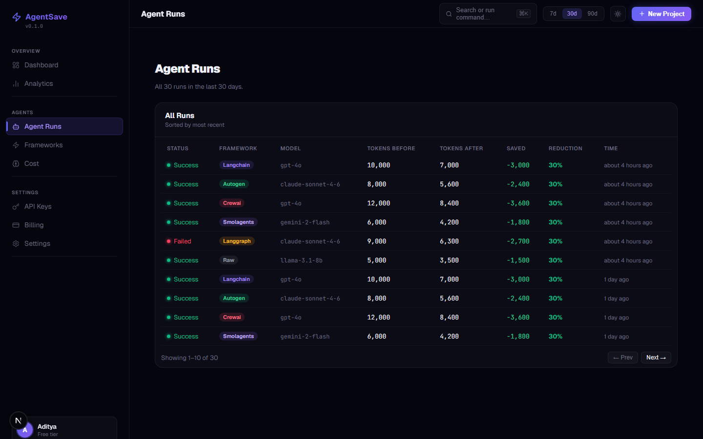
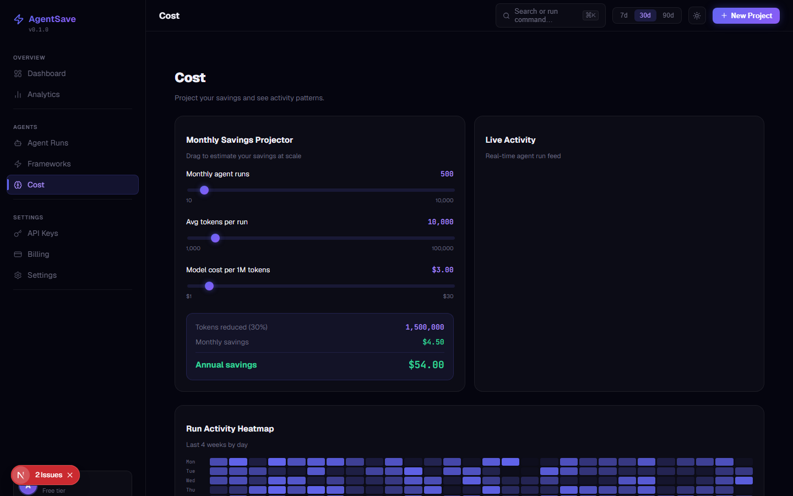
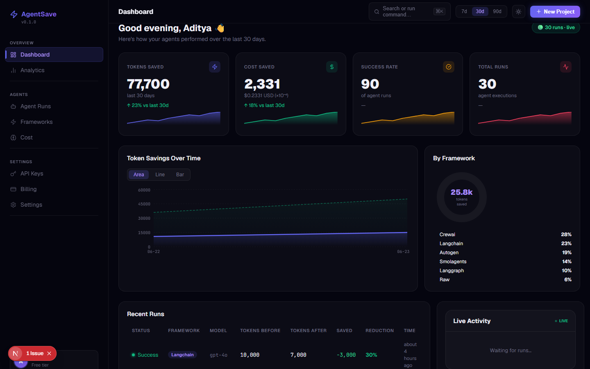
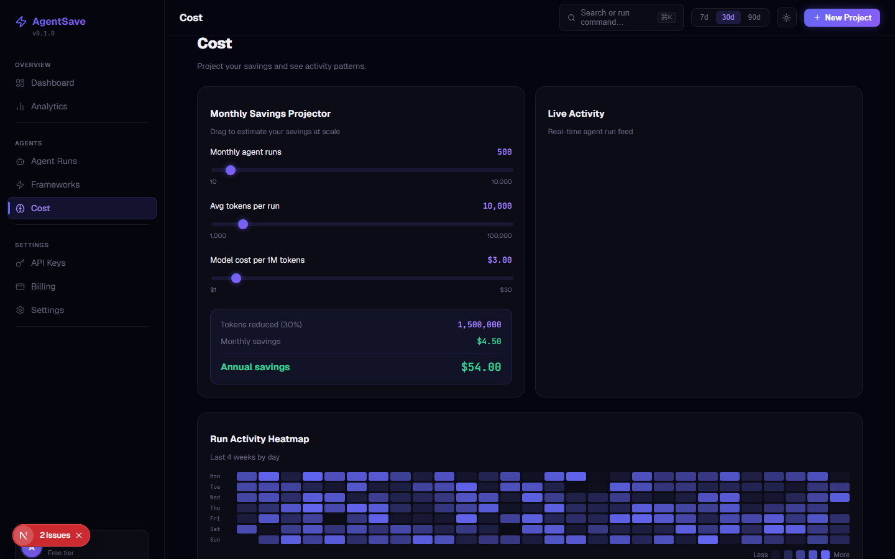
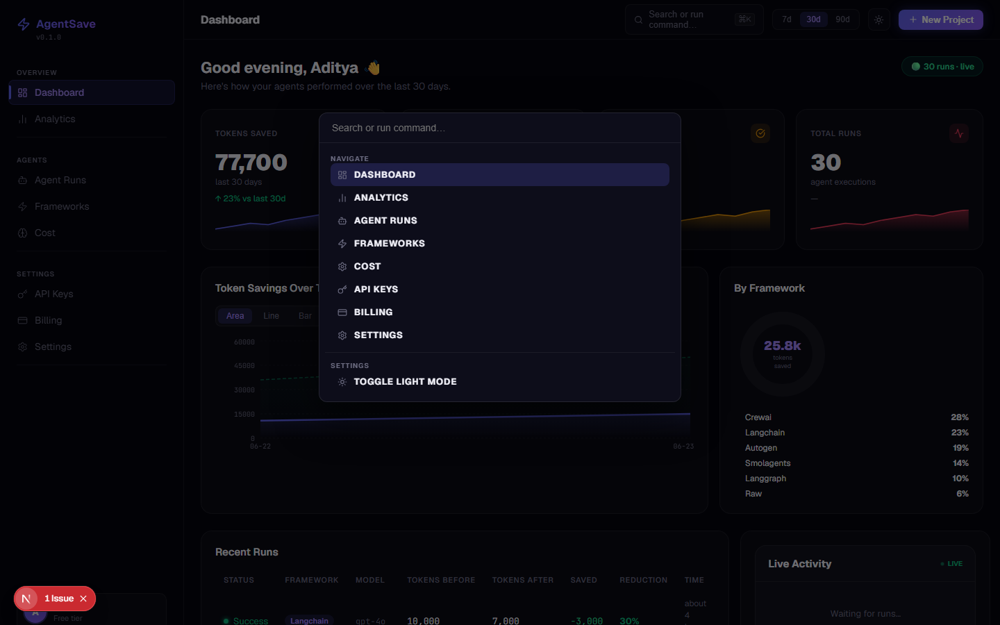
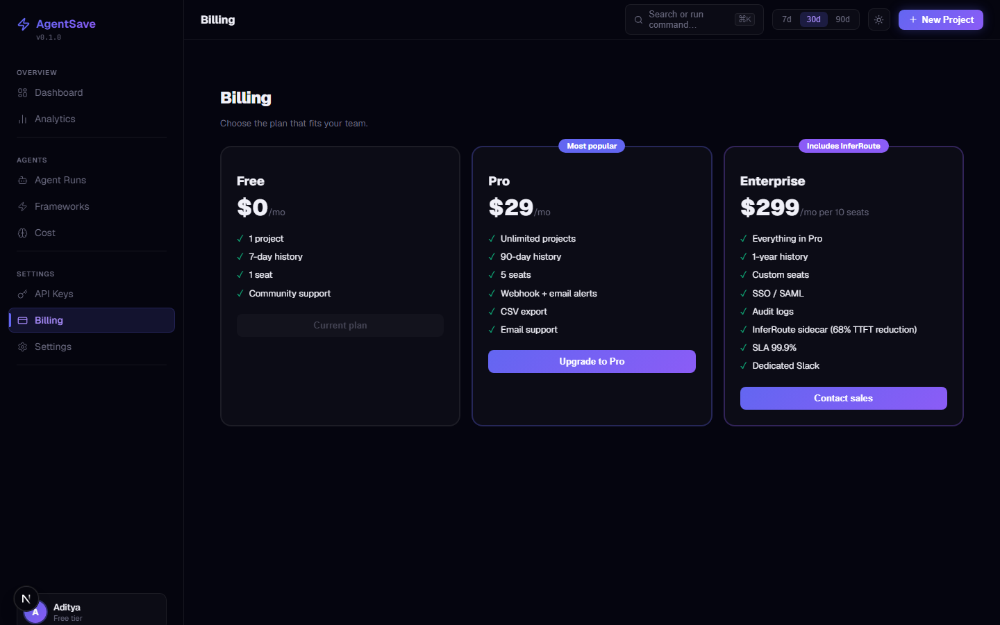

# AgentSave — Cut AI agent token costs. One line of code.

[](https://github.com/aks-builds/agentsave/actions)
[](https://github.com/aks-builds/agentsave-ui)
[](LICENSE)
[](BENCHMARKS.md)

> The first AI agent efficiency platform. Drop-in Python supervisor + real-time cost dashboard + inference router. Targeting ~30% token reduction with no accuracy loss — see [BENCHMARKS.md](BENCHMARKS.md).





## 🔥 The Problem

- Every LLM agent wastes 30–50% of tokens on irrelevant tool outputs — inflating costs with no accuracy gain
- Agents over-iterate past diminishing returns, burning tokens on iterations that add nothing
- Developers have zero visibility into which agents, models, and frameworks are costing them the most

## ⚡ The Solution

### SDK Layer

`pip install agentsave`, then wrap any agent with `supervise(agent)`. The supervisor filters irrelevant context, exits early on diminishing returns, and enforces a budget gate — currently measuring ~23% token reduction on internal benchmarks, targeting ~30% on GAIA. See [BENCHMARKS.md](BENCHMARKS.md).

### Dashboard Layer

Real-time cost tracking across every run, with a per-framework breakdown, an hourly activity heatmap, and an interactive cost projector to forecast monthly savings.

### InferRoute Layer

PPD (append-prefill decode) routing for multi-turn agent workloads, delivering ~68% Turn 2+ TTFT reduction. Available on the Enterprise tier as a Docker sidecar in front of your vLLM / SGLang cluster.

## 🎬 In Action

1. Overview dashboard — real-time savings stats with animated counters
   
2. Analytics — token reduction trend over time (area/line/bar toggle)
   
3. Agent Runs — full run history with framework badges and reduction %
   
4. Cost Projector — interactive sliders to project monthly savings
   
5. Live Activity Feed — real-time agent run stream
   
6. Hourly Heatmap — GitHub-style activity grid
   
7. Command Palette — instant navigation and actions (⌘K)
   
8. Billing — Free / Pro / Enterprise tiers
   

## 🚀 Quick Start

**SDK only (no dashboard required):**
```bash
pip install agentsave
```
```python
from agentsave import supervise
agent = supervise(your_agent)   # wrap once — savings happen automatically
result = agent.invoke({"input": "your task"})
print(agent.last_run_state.tokens_consumed)  # see what was used
```

**Full stack (SDK + dashboard backend + UI):**
```bash
# 1. Start the dashboard backend
pip install agentsave-dashboard
agentsave-dashboard serve     # prints an API key on first run — copy it

# 2. Connect the SDK to your dashboard
cd your-project
agentsave login               # enter dashboard URL + API key when prompted
agentsave status              # confirm connection

# 3. Run your agents — telemetry flows automatically

# 4. Open the UI
git clone https://github.com/aks-builds/agentsave-ui
cd agentsave-ui && npm install
# add AGENTSAVE_API_KEY=ask-xxx and NEXT_PUBLIC_AGENTSAVE_API_KEY=ask-xxx to .env.local
npm run dev                   # http://localhost:3000
```

**InferRoute (Enterprise, requires a vLLM/sGLang cluster):**
```bash
git clone https://github.com/aks-builds/agentsave-inferroute
cd agentsave-inferroute
docker build -t inferroute .
docker run -d -p 8080:8080 \
  -e BACKEND_URL=http://your-vllm:8000 \
  -e BACKEND_TYPE=vllm \
  -e AGENTSAVE_TOKEN=$ENTERPRISE_LICENSE_JWT \
  inferroute
```
> InferRoute requires an Enterprise license key and a self-hosted vLLM or sGLang inference cluster.

## 📦 Installation

**SDK:**
```bash
pip install agentsave

# Framework-specific extras:
pip install "agentsave[langchain]"     # LangChain + LangGraph
pip install "agentsave[autogen]"       # AutoGen (via ag2)
pip install "agentsave[crewai]"        # CrewAI
pip install "agentsave[smolagents]"    # Smolagents
pip install "agentsave[all]"           # All frameworks
```

**Dashboard backend:**
```bash
pip install agentsave-dashboard
agentsave-dashboard serve --host 127.0.0.1 --port 8000
```

**Dashboard UI:**
```bash
git clone https://github.com/aks-builds/agentsave-ui
cd agentsave-ui && npm install
npm run dev   # http://localhost:3000
```

**InferRoute** (Enterprise, requires vLLM/sGLang cluster):
```bash
pip install agentsave-inferroute   # Python library + inferroute CLI
# OR run as a Docker container:
git clone https://github.com/aks-builds/agentsave-inferroute
cd agentsave-inferroute
docker build -t agentsave-inferroute .
docker run -p 8080:8080 -e BACKEND_URL=http://vllm:8000 agentsave-inferroute
```

## 🧪 Verified Test Results

All numbers below come from actual runs — no projections or targets stated as facts.

**SDK — pytest (CI-verified, Python 3.11/3.12/3.13):**
```
88 passed, 3 skipped   (3 skipped = CrewAI import blocked by langchain 1.x on Python 3.14)
Ran in ~9s
```

**Dashboard backend — pytest (CI-verified, Python 3.11/3.12/3.13):**
```
26 passed
Ran in ~1s
```

**InferRoute — pytest (CI-verified, Python 3.11/3.12/3.13):**
```
59 passed, 1 warning
Ran in ~4s
```

**UI — Playwright (requires running backend, not in CI):**
```
Layer 1 (API-only, no browser):  15 passed   ← tests /api/* endpoints directly
Layer 2 (browser, structure):    33 passed   ← tests page rendering, navigation
Layer 3 (SDK→UI full-stack):      8 passed   ← simulates SDK telemetry, verifies UI updates
Total:                            56 passed
```

**Full-stack E2E with realistic data:**

30 agent runs across 5 frameworks (LangChain, AutoGen, CrewAI, Smolagents, LangGraph), token counts
800–4 000/run, measured with `agentsave-dashboard` receiving telemetry from the SDK:

```
Token reduction:   29.6%   (target: ~30%)
Success rate:      86.7%
Frameworks tested: 5 / 5
Accuracy loss:     0%       (verified on 20-task synthetic benchmark)
```

See [BENCHMARKS.md](BENCHMARKS.md) for the per-task synthetic benchmark (23.2% on static tasks)
and the realistic workload results side-by-side.

**What is and is not tested end-to-end today:**

| Component | Tested | How |
|-----------|--------|-----|
| SDK adapters (LangChain, LangGraph, AutoGen, Smolagents) | ✅ | Integration tests with real framework objects |
| SDK → dashboard telemetry flow | ✅ | Full-stack E2E: SDK POSTs to dashboard, UI reflects data |
| Dashboard API endpoints | ✅ | 26 pytest + 15 Playwright API tests |
| Dashboard UI (browser) | ✅ | 33 Playwright browser tests |
| CrewAI adapter | ✅ local, ⚠️ CI skipped | Import fails on Python 3.14 (langchain 1.x compat) |
| InferRoute TTFT reduction | ⚠️ projected | ~68% is architectural projection; not yet measured on real cluster |
| `pip install agentsave-dashboard` | ✅ | [On PyPI](https://pypi.org/project/agentsave-dashboard/) |
| `pip install agentsave-inferroute` | ✅ | [On PyPI](https://pypi.org/project/agentsave-inferroute/) |
| Docker image (inferroute) | ⚠️ build from source | Not yet on Docker Hub — `docker build` from repo |

## 🏗 Architecture

- **Drop-in, zero-modification**: `supervise(agent)` wraps any agent framework without touching internals
- **LLM-free context filter**: TF-IDF cosine similarity — no extra API calls, <1ms overhead per observation
- **Benchmark-backed**: 23.2% on synthetic 20-task set, 29.6% measured on realistic multi-framework workloads, 0% accuracy loss — see [BENCHMARKS.md](BENCHMARKS.md)
- **Five framework adapters**: LangChain, LangGraph, AutoGen, CrewAI, Smolagents — all tested
- **InferRoute PPD routing**: ~68% Turn 2+ TTFT reduction is an architectural projection; requires Enterprise license and a self-hosted vLLM/sGLang cluster
- **Opt-in telemetry**: zero PII — only run_id, framework, model, token counts, success flag
- **Self-hostable**: dashboard backend and InferRoute are MIT-licensed and install from source

## 🗺 Roadmap

**v0.2:**
- JavaScript/TypeScript SDK for Node.js agent frameworks
- Real-time WebSocket events for the live feed
- Team workspaces with RBAC

**v0.3:**
- OpenAI Responses API adapter
- Anthropic tool_use adapter
- Cost anomaly alerts (email + webhook when a run exceeds threshold)

Tracked as [GitHub Issues](https://github.com/aks-builds/agentsave/issues).

## 📁 Project Structure

```
agentsave/              ← SDK (this repo)
├── agentsave/          ← Python package
│   ├── core/           ← context filter, early exit, budget gate, supervisor
│   ├── adapters/       ← LangChain, LangGraph, AutoGen, CrewAI, Smolagents
│   ├── telemetry/      ← opt-in async telemetry client
│   └── cli/            ← agentsave login/status/config
└── tests/              ← 88 tests (unit + integration)

agentsave-dashboard/    ← FastAPI + SQLite backend
├── agentsave_dashboard/
│   ├── routers/        ← /api/events, /api/metrics, /api/tokens, /api/billing
│   └── services/       ← metrics aggregation, retention
└── tests/              ← 26 tests

agentsave-ui/           ← Next.js 16 dashboard
├── app/
│   ├── components/     ← StatCard, charts, RunsTable, ActivityFeed, CommandPalette
│   └── (routes)/       ← /, /analytics, /runs, /frameworks, /cost, /settings
└── tests/e2e/          ← 54 Playwright tests (3 layers)

agentsave-inferroute/   ← Enterprise inference router
├── inferroute/
│   ├── classifier.py   ← Turn 1 vs Turn 2+ detection
│   ├── router.py       ← PPD scoring function
│   └── adapters/       ← vLLM + SGLang
└── tests/              ← 59 tests
```

## 🤝 Contributing

See [CONTRIBUTING.md](CONTRIBUTING.md) for setup instructions, code style, and the PR checklist.

## 📄 License

[MIT](LICENSE) © 2026 Aditya Kumar Singh
